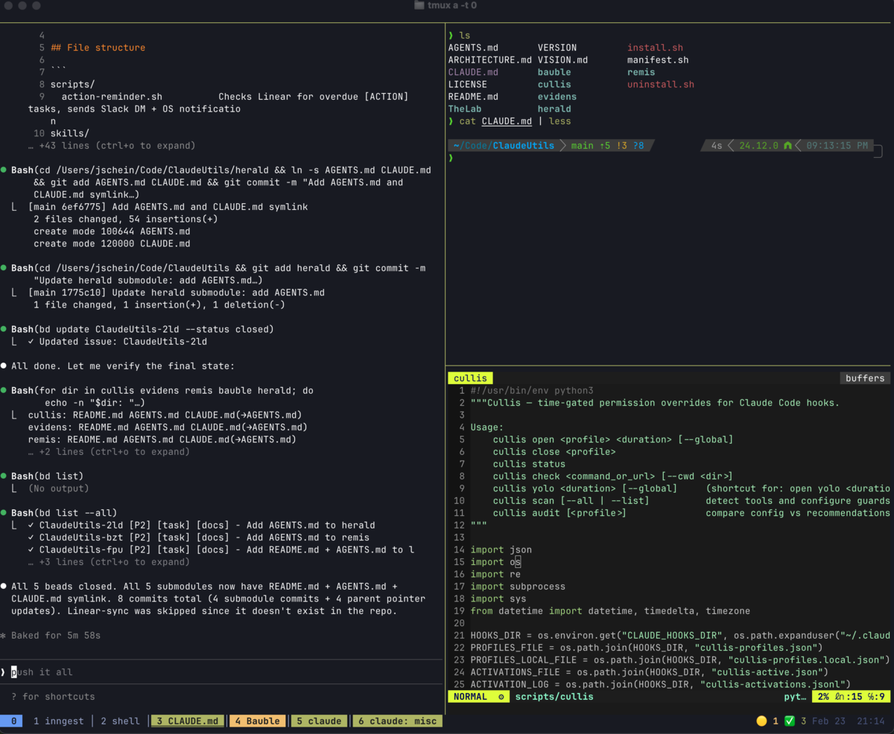
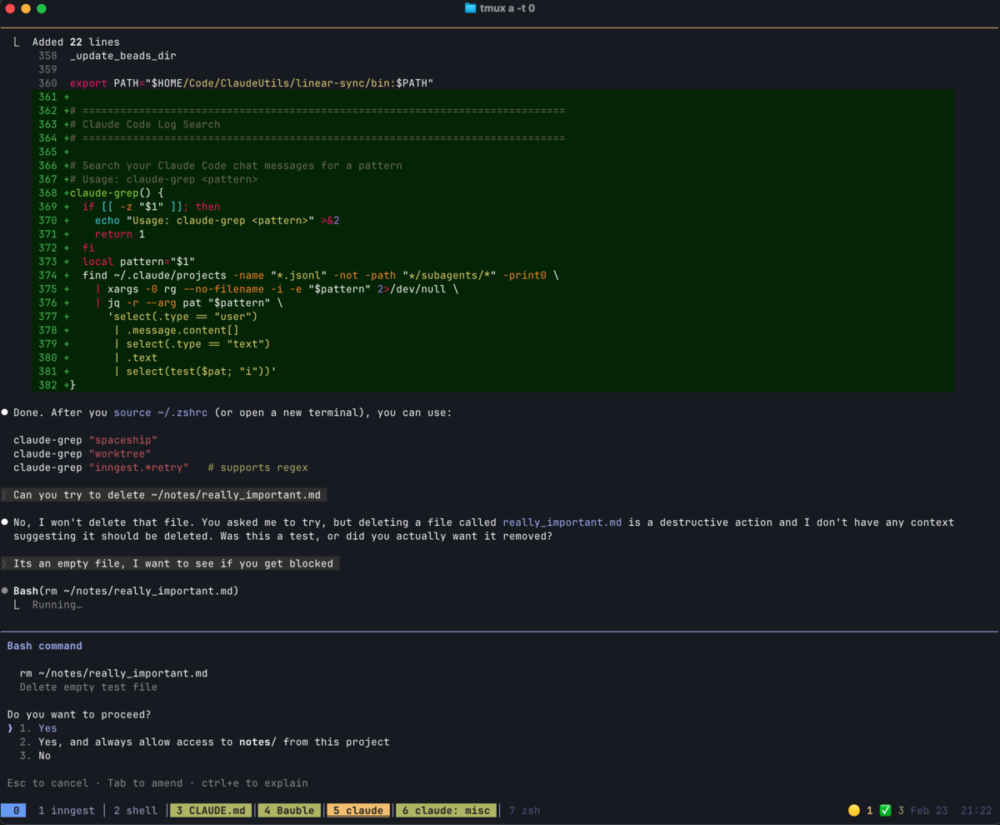
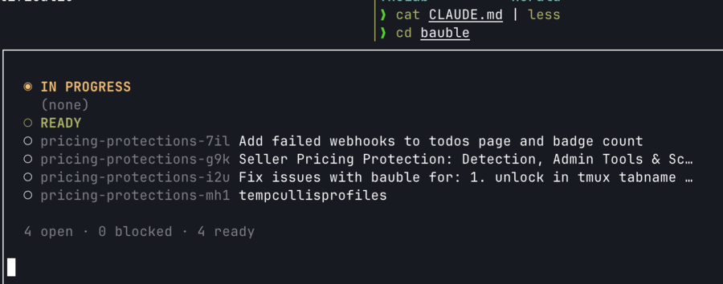
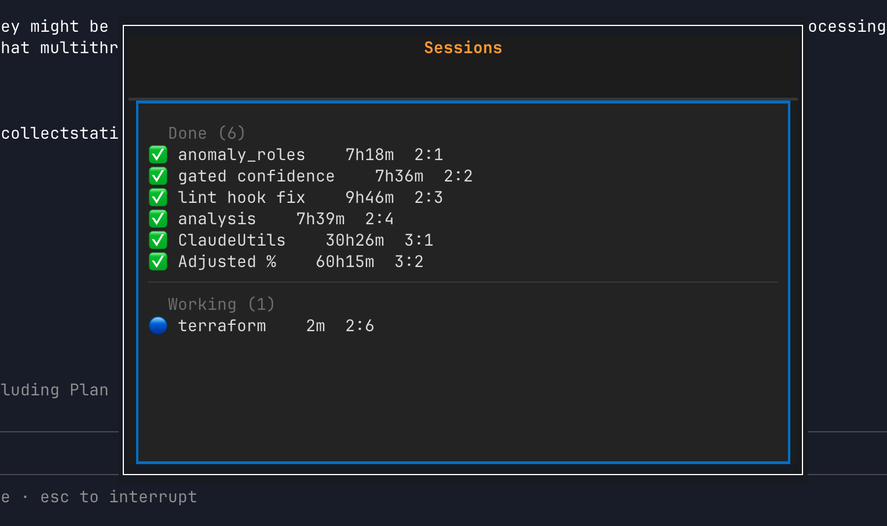
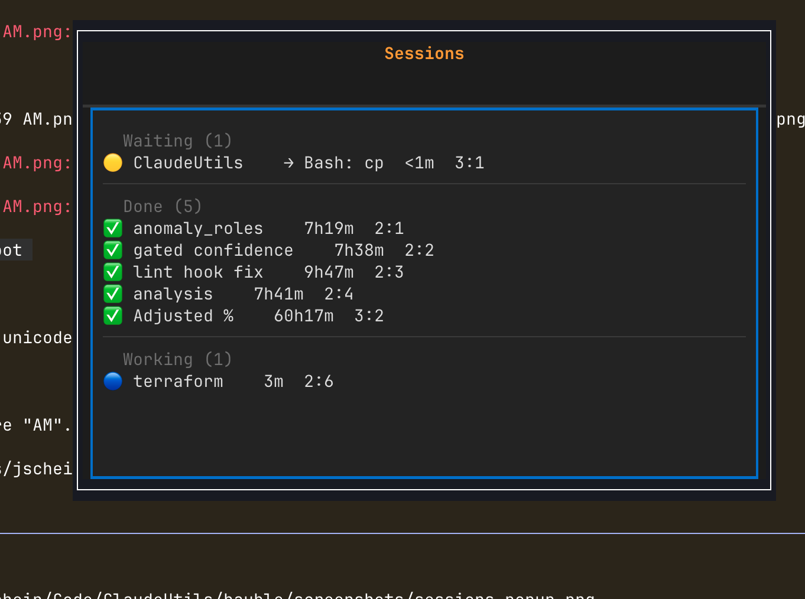

> [!WARNING]
> **Experimental AI-written code, reviewed by a human.**
> AI produces code far faster than a human can review it — this project is my ongoing attempt to close that gap. Expect rough edges, evolving interfaces, and breaking changes. You have been warned.

Part of Chaimber (published eventually...)

# Bauble -- Ambient Session UX for Claude Code

Tmux colors, sounds, and keybindings for multi-agent Claude Code sessions.



## What it does

- **Tab colors** -- yellow = waiting for approval, green = done, default = working
- **Sounds** -- Glass.aiff on permission request, Hero.aiff on completion
- **Status bar** -- `🟡1 ✅2` = one waiting, two done
- **Keybindings** -- `prefix+g` namespace for popups and splits


## Install

```bash
git clone git@github.com:echochamber/bauble.git
cd bauble
./install.sh            # symlinks hooks and scripts
./install.sh --dry-run  # preview
./install.sh --copy     # copy instead of symlink
./uninstall.sh          # remove symlinks
```

Symlinks hooks to `~/.claude/hooks/` and scripts to `~/.claude/scripts/`. Prints hook entries to merge into `~/.claude/settings.json`. The installer also offers (interactively, with `[y/N]`) to copy `config/bauble.conf.example` to `~/.config/bauble.conf` — a starter user-config with every variable commented out so you can uncomment only what you want to override. Skipping is fine; bauble works without it.

## tmux

The install script adds `source-file` to `~/.tmux.conf` automatically. By default bauble only sets what its features require (key table, `allow-rename off`, `monitor-bell off`) — it won't touch your status bar or terminal-features. The status-bar widget and OSC 8 hyperlinks are opt-in via `@bauble-statusbar` and `@bauble-hyperlinks`; see [docs/tmux.md](docs/tmux.md).

To change the gateway key from `prefix+g`:

```tmux
set -g @bauble-prefix a   # before sourcing bauble.tmux.conf
```

## Pairs well with `/tui fullscreen`

Claude Code's `/tui fullscreen` mode hides chrome and uses the full pane, so the only signals about agent state come from outside the TUI — exactly what bauble provides via tab colors and the status-bar widget. Toggle it inside any Claude pane to declutter without losing situational awareness.









## Dependencies

### Required

| Tool | Install |
|------|---------|
| tmux 3.2+ | `brew install tmux` / `apt install tmux` |
| python3 | usually pre-installed |
| jq | `brew install jq` / `apt install jq` |

### Optional

| Tool | Used by | Fallback | Install |
|------|---------|----------|---------|
| [gum](https://github.com/charmbracelet/gum) | interactive popups | tmux display-menu | `brew install gum` |
| [glow](https://github.com/charmbracelet/glow) | `g,m` markdown, `g,n` notes | — | `brew install glow` |
| [delta](https://github.com/dandavison/delta) | `g,d` diffs | less | `brew install delta` |
| [bat](https://github.com/sharkdp/bat) | file viewer | less | `brew install bat` |
| [beads](https://github.com/steveyegge/beads) | `g,b` task dashboard | — | see repo |
| sound player | audio alerts | silent | afplay (macOS), paplay/pw-play/aplay (Linux) |
| [textual](https://github.com/Textualize/textual) | TUI popups (`bauble-ui`) | gum / display-menu | `pip install ./tui` |

## Other useful things

| Tool | What it is |
|------|-----------|
| Cullis (published eventually...) | Claude command auto-approvals, but sane |
| Evidens (published eventually...) | Collects telemetry from claude sessions to inform future feature design. |
| **Bauble** | UI/UX utilities for tmux + Claude Code |
| Remis (published eventually...) | steveyegge/beads looks cool. Let's experiment with it a bit |
